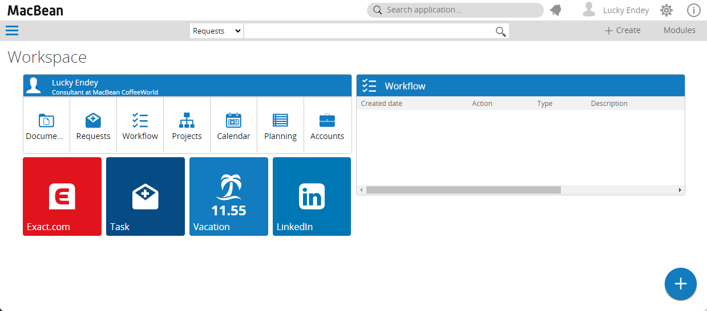
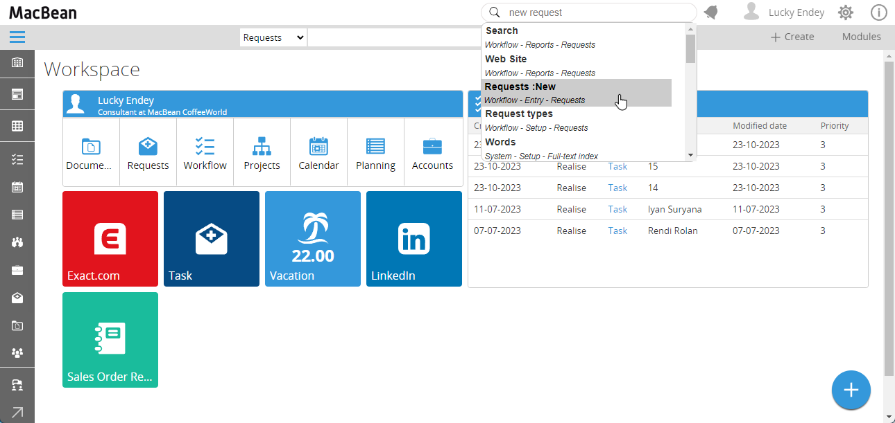

# SynergyX AppSearch

## Summary

The **SynergyX AppSearch** is a simple addon designed to enhance the user experience within Exact Synergy Enterprise. This addon provides a seamless search functionality, allowing users to quickly locate applications by typing in a search box.

## Installation

To install the **SynergyX AppSearch** tool, follow these steps:

1. **Download the Addon:**
   - Download the latest version of the addon from the <a href="https://github.com/luckyendey/CSSynergyX.AppSearch/releases">releases page</a>.

2. **Install the Addon:**
   - Extract the contents of the downloaded ZIP file (e.g., SynergyX.AppSearch-v1.x.zip) to a folder on your computer.
   - Copy all the extracted files and folders from SynergyX.AppSearch-v1.x directory.
   - Paste these files into the installation directory of your Exact Synergy Enterprise application. Ensure that you replace any existing files if prompted.

3. **Verify Installation:**
   - Open Exact Synergy Enterprise application.
   - The search box will show on the left of the notification icon.
   - 

## How to Use

Once the addon is installed, you can start using the search functionality as follows:

1. **Enter Search Query:**
   - Type the name or part of the name of the application you are looking for in the search box.
   - Even if you type the words in the wrong order and typo, the search will still work (e.g., "nw requset" for "Request New").
   - Since the the "Settings" application is present in almost every module, you can also type a combination of module name, menu tab, group, and application name (e.g., type "system dtap setting" to find the Settings application under "Modules -> System -> Setup -> DTAP Management - Settings").

1. **View Results:**
   - As you type, the search box will display a list of matching applications.
   - Click on an application from the search results to be redirected to its details page.
- 


## How to Contribute

I greatly value contributions of all kinds, including those related to **security**, **performance**, **UI/UX**, and more, to enhance the SynergyX AppSearch addon. Here’s how you can get involved:

1. **Fork the Repository:**
   - <p>Go to the <a href="https://github.com/luckyendey/CSSynergyX.AppSearch">repository</a> and click on Fork to create your own copy.</p>

2. **Make Your Changes:**
   - Clone your forked repository to your local machine:
     ```bash
     git clone https://github.com/luckyendey/CSSynergyX.AppSearch.git
     ```
   - Create a new branch for your changes:
     ```bash
     git checkout -b feature/your-feature-name
     ```
   - Implement your changes or fixes.

3. **Submit a Pull Request:**
   - Push your changes to your forked repository:
     ```bash
     git add .
     git commit -m "Describe your changes"
     git push origin feature/your-feature-name
     ```
   - Open a pull request in the original repository to propose your changes.

4. **Report Issues:**
   - If you find any bugs or have feature requests, please open an issue in the <a href="https://github.com/luckyendey/CSSynergyX.AppSearch/issues">issues tracker</a>.

